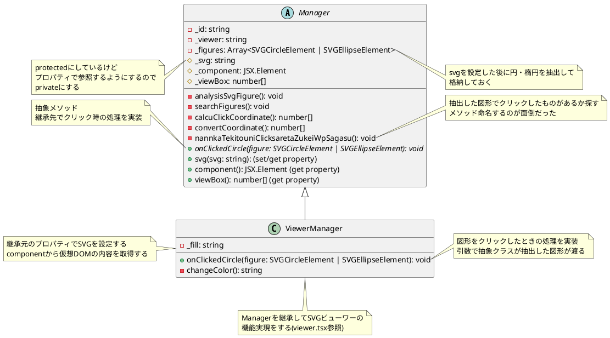

# クラス構成

```plantuml
@startuml
abstract class Manager {
    - _id: string
    - _viewer: string
    - _figures: Array<SVGCircleElement | SVGEllipseElement>
    # _svg: string
    # _component: JSX.Element
    # _viewBox: number[]
    - analysisSvgFigure(): void
    - searchFigures(): void
    - calcuClickCoordinate(): number[]
    - convertCoordinate(): number[]
    - nannkaTekitouniClicksaretaZukeiWpSagasu(): void
    + {abstract} onClickedCircle(figure: SVGCircleElement | SVGEllipseElement): void
    + svg(svg: string): (set/get property)
    + component(): JSX.Element (get property)
    + viewBox(): number[] (get property)
}

class ViewerManager {
    - _fill: string
    + onClickedCircle(figure: SVGCircleElement | SVGEllipseElement): void
    - changeColor(): string
}

note left of Manager::svg
    protectedにしているけど
    プロパティで参照するようにするので
    privateにする
end note

note left of Manager::onClickedCircle
    抽象メソッド
    継承先でクリック時の処理を実装
end note

note right of Manager::_figures
    svgを設定した後に円・楕円を抽出して
    格納しておく
end note

note right of Manager::nannkaTekitouniClicksaretaZukeiWpSagasu
    抽出した図形でクリックしたものがあるか探す
    メソッド命名するのが面倒だった
end note

note left of ViewerManager
    継承元のプロパティでSVGを設定する
    componentから仮想DOMの内容を取得する
end note

note bottom of ViewerManager
    Managerを継承してSVGビューワーの
    機能実現をする(viewer.tsx参照)
end note

note right of ViewerManager::onClickedCircle
    図形をクリックしたときの処理を実装
    引数で抽象クラスが抽出した図形が渡る
end note

Manager <|-- ViewerManager
@enduml
```