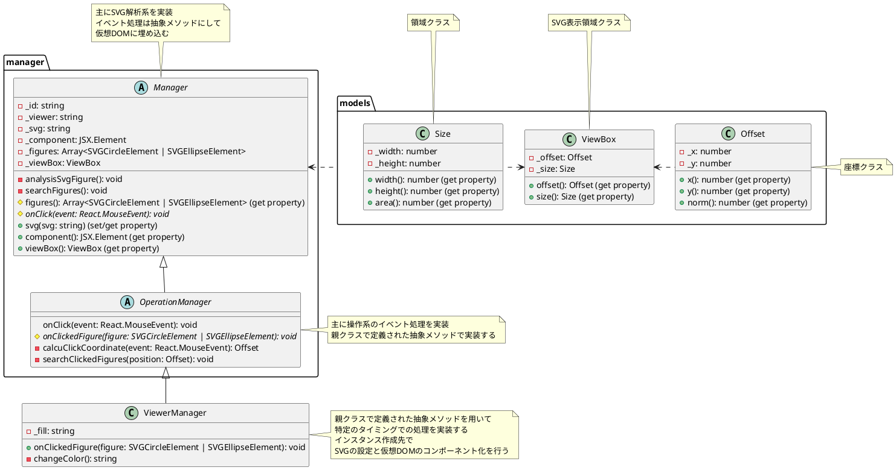

# クラス構成

```plantuml
@startuml

package models {
    class Offset {
        - _x: number 
        - _y: number 
        + x(): number (get property)
        + y(): number (get property)
        + norm(): number (get property)
    }

    class Size {
        - _width: number 
        - _height: number 
        + width(): number (get property)
        + height(): number (get property)
        + area(): number (get property)
    }

    class ViewBox {
        - _offset: Offset 
        - _size: Size 
        + offset(): Offset (get property)
        + size(): Size (get property)
    }
}

package manager {
    abstract class Manager {
        - _id: string
        - _viewer: string
        - _svg: string
        - _component: JSX.Element
        - _figures: Array<SVGCircleElement | SVGEllipseElement>
        - _viewBox: ViewBox
        - analysisSvgFigure(): void
        - searchFigures(): void
        # figures(): Array<SVGCircleElement | SVGEllipseElement> (get property)
        # {abstract} onClick(event: React.MouseEvent): void
        + svg(svg: string) (set/get property)
        + component(): JSX.Element (get property)
        + viewBox(): ViewBox (get property)
    }

    abstract class OperationManager {
        onClick(event: React.MouseEvent): void
        # {abstract} onClickedFigure(figure: SVGCircleElement | SVGEllipseElement): void
        - calcuClickCoordinate(event: React.MouseEvent): Offset
        - searchClickedFigures(position: Offset): void
    }
}

class ViewerManager {
    - _fill: string 
    + onClickedFigure(figure: SVGCircleElement | SVGEllipseElement): void
    - changeColor(): string
}


Manager <|-- OperationManager
OperationManager <|-- ViewerManager

Manager <. models
ViewBox <. Offset
ViewBox <. Size

note top of Manager
    主にSVG解析系を実装
    イベント処理は抽象メソッドにして
    仮想DOMに埋め込む
end note

note right of OperationManager
    主に操作系のイベント処理を実装
    親クラスで定義された抽象メソッドで実装する
end note

note right of ViewerManager
    親クラスで定義された抽象メソッドを用いて
    特定のタイミングでの処理を実装する
    インスタンス作成先で
    SVGの設定と仮想DOMのコンポーネント化を行う
end note

note right of Offset
    座標クラス
end note

note top of Size
    領域クラス
end note

note top of ViewBox
    SVG表示領域クラス
end note

@enduml
```